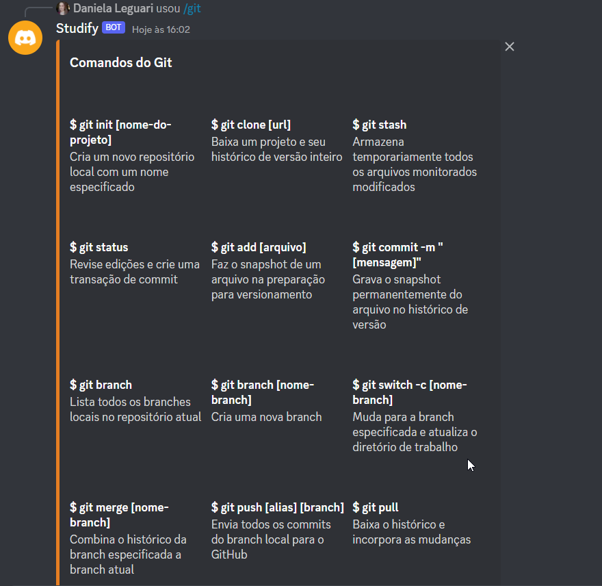
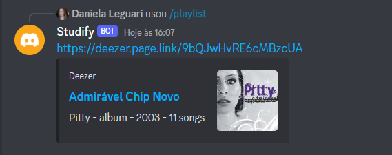
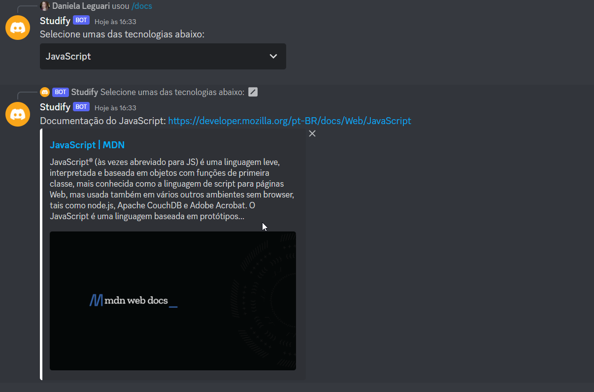

# bot-discord

## Documentação

- gerenciador de pacote node;
- Acessar https://discord.js.org/#/
- npm install discord.js;
- npm init -y;

## Criando seu bot

- Acessar https://discord.js.org/#/
- Seção setting up a bot application e seguir o passo a passo

## testando no Discord

- Você precisará de um servidor no discord;
- Retorne ao Discord developer portal e vá en OAuth2/URL Generator e selecione as permissões do bot;
- Copiar a URL e colar numa nova guia do seu navegador;
- selecione o seu servidor, autorizando o seu bot será adicionado ao servidor;

## Dando "vida" ao seu bot

- retorne ao Guide do Discord/js;
- e insira em um arquivo .env no projeto (instale npm install .env no projeto) as seguintes informações:
TOKEN= acessar no Guide n aba Bot
CLIENT_ID= acessar no Guide na aba OAuth2/General
GUILD_ID= id do seu servidor

# Imagens Bot Stydify 

- Comando Ping

- Comando git

- Comando playlist

- comando docs

## Observações

- Para logar o bot `node index.js`;
- A cada comando criando rodar `node deploy-commands`;
